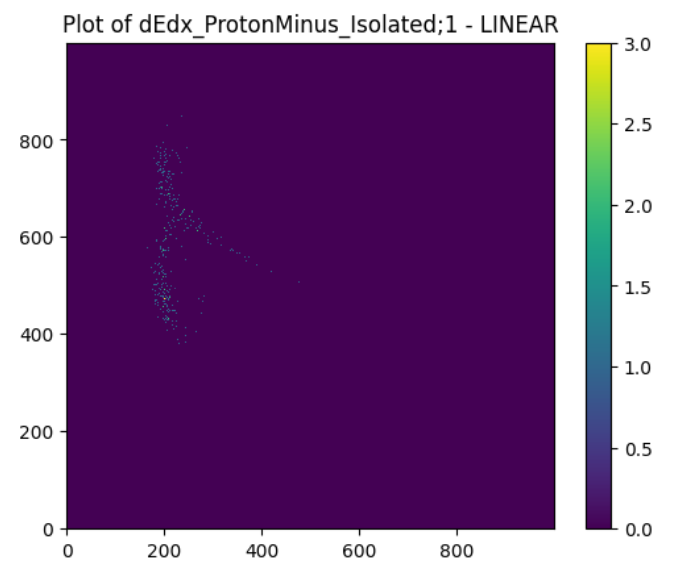
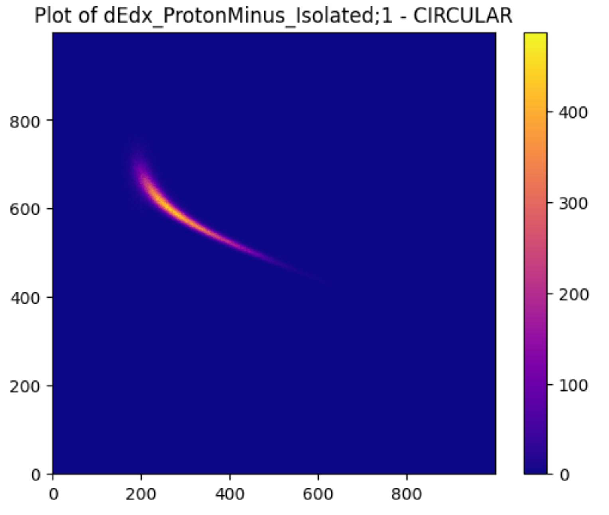

### ECS 171: Machine Learning (Group 9)

# Analysis on the Particle Collider Dataset

# Abstract
We have two datasets, `Output_File_2023_02_15.root` which includes data about the linear collisions and `yieldHistos_7p7GeV_Pion_2022_08_31.root` which contains data about circular. The project idea is to analyze the datasets on the shape of explosions from a particle collider in order to determine what aspects of the particles used and conditions are common between collider and detector types. These findings would be significant because they can help researchers determine the collider type they should use when looking to collide heavy ion particles.

Two problems we intend to solve using supervised learning techniques include:
1. classifying linear and spherical collisions 
    1. using SVM and binary classification models
1. predicting count of decayed particles based on 3 features (stopping power, position, and collision type)
    1. using a regression model

For unsupervised learning, we will experiment with generators where our goal will be to generate fake data that
matches our real data distribution and is indistinguishable from our real data.

# Introduction
(write here)

# Methods
## Data Exploration Results
### Description of Data
We compiled the relevant columns from both the linear collisions dataset and circular collisions dataset into a
mutable dataframe. Although this dataframe appears to only have 2 rows, contained within those rows contain are
1000x1000 matrices representing data from over 91,000 collisions. This way of packaging the data allows physicists
to work with larger quantities of data then would be compatible with a csv file. The original .root files had over
200 different features, but the the features that we choose to include in our dataframe and thus to analyse were
dEdx_PionPlus_Isolated;1, dEdx_PionMinus_Isolated;1, dEdx_KaonPlus_Isolated;1, dEdx_KaonMinus_Isolated;1,
dEdx_ProtonPlus_Isolated;1, dEdx_ProtonMinus_Isolated;1, dEdx_DeuteronPlus_Isolated;1, dEdx_DeuteronMinus_Isolated
1, dEdx_TritonPlus_Isolated;1, dEdx_HelionPlus_Isolated;1, dEdx_HelionMinus_Isolated
1, dEdx_AlphaPlus_Isolated;1, and dEdx_AlphaMinus_Isolated;1. We decided to use these datapoints because each
feature isolates stopping power data per composite particle and these features coincide in both files.

### Descriptions of Graphs 
The y axis on our plots represents stopping power per particle. The x axis represents mass energy of a particle. We
decided to leave the y axis inverted when graphing in order to make the y axis stand out more from the x axis to
help with our analysis. Some interesting trends we noticed on these graphs were a small variance along the axis for
pions and deuteron and proton minus distributions and logarithmic correlations with other distributions.

Plot of counts collected for ProtonMinus at various stopping powers and positions in linear collisions

Plot of counts collected for ProtonMinus at various stopping powers and positions in circular collisions

## Data Preprocessing (steps)
1. Analyze original linear and circular `.root` files to determine which features coincide in both files
2. Convert 13 1000x1000 matrices into tabular data form
    1. One-hot encode our `linear` and `circular` features
    2. Iterate through each matrix in order to find all indexes where at least one feature has data
    3. Create dataframes for each matrix consisting of 'position' 'stopping power' and the count of that feature such that all dataframes contain the same values for 'position' and 'stopping power'
    4. Concatenate all individial feature dataframes together based on 'position' and 'stopping power' index. We call this master dataframe 'holygrail'
    5. Download 'holygrail' as a csv
3. Normalizing and splitting 
    1. Split `train`, `validation` and `test` sets with a split ratio of 70:10:20, respectively
    2. Normalize `train`, `validation` and `test` sets separately
    3. Within the normalizer function: normalize `circular` and `linear` elements separately and ensure and equal number of each is in each training, testing, and val set
    4. Within the normalizer function: Threshold very small values and delete rows with no significant data

## Model 1: Binary Classification - Linear vs. Circular Collider Types
### Description
Model 1: Binary Classification - Linear vs. Circular Collider Types
Description
In hopes of predicting the type of collider, either circular or linear, we use a 10-layer ANN that takes in the feature counts, positions, and stopping powers and classifies the data as one of our one-hot-encodered collider types
* Architecture: we use Relu activation functions for efficent runtime. We also use Sigmoid activation function in our output layer to classify the 2 groups, and use the binary_crossentropy function to update our model weights and bias. We split our dataset into 90:10 of propotion, with linear and circular columns as our target and every other columns as our features.
* We incorportated EarlyStopping and ModelCheckpoint to ensure we were getting the best weights possible and not spending more time training than the model needed.
* We also incorporated validation data into our training in order to find the best models for ModelCheckpoint.
* The validation, training, and testing data were all normalized seprately and there was no possibility of data leakage
* There was also an equal number of both classes in all sets in order to avoid bais
* We tested the model on unseen values and report the accurary_score, classification report, and a confusion matrix as well as the epoch at which we found our best model based on ModelCheckpoint and EarlyStopping
### K-folds
* In order to test the models consistancy accross unseen data, we tested it on 5 folds in which a random section of the training data was sectioned off as validation data and normalized seperately.
* The goal was to try to get a high mean and low sd to indicate that our model has low variation and is consistantly accurate at predicting unseen data

## Model 2: Binary Classification Using SVM - Linear vs. Circular Collisions
### Description
To further classifying the Linear vs Circular Collisions, we attempt at using a SVM model to illustrate the boundary between the 2 particles collide with each other. We hypothesize that the position and the stopping power greatly influence the classification problem. Therefore, classification model without the 2 important features would have low accuracy score. To test this hypothesis, we pick 2 features that has the highest correlation with the target variables: `dEdx_KaonPlus_Isolated;1` and `dEdx_PionPlus_Isolated;1`, with a correlation of 0.18, and 0.25 respectively. We also test the model with `position` and `stopping power` in order to confirm their hypothesis. These 2 variables are selected because they are highly correlated with target variables, about -0.57 and 0.059 shown on the heatmap.  
* Architecture: In our svm model, we take features `dEdx_PionPlus_Isolated;1` and `dEdx_KaonPlus_Isolated;1`. With Radial Basis Function Kernel (RBF) function to as our kernel.
* We check the accurary_score for performance, as well as illustrating classification report and the confusion matrix for model performance.

## Model 3: Regression -Predicting the counts of particles based on the position and stopping power at which they were detected as well as the collider type
Predicting the Count of Each Decayed Particle
### DescriptionDescription
* To increase the complexity of our project, we decided to make an attempt at predicting the count of decayed particles detected at a certain stopping power and position under either a circular or linear collision. To do this, we use build a 4-layer linear regression ANN model.
* Architecture: In our 1st hidden layer we use a linear activation function than then feeds its outputs into the 2nd hidden layer which uses a LeakyRelu activation functions (the 3rd hidden layers follow this same architecture). The output layer makes use of a linear activation function. To update our model weights and bias, we use the MSE loss function.
* Once again, we used EarlyStopping and ModelCheckpoint to ensure we were getting the best weights possible and not spending more time training than the model needed.
* The loss function is set up. The loss function is used to measure the difference between the model's predicted value and the real label.
* The average square error between the model's predicted value and the actual value. The goal of the optimization model is to minimize the MSE and make the prediction as close to the true value as possible.
* Optimizer='adam': The optimizer is used to update the weights in the neural network to minimize the loss function. 'adam' is a commonly used optimization algorithm, it is a gradient descent based method that usually performs well in deep learning.
* The loss function is set up. The loss function is used to measure the difference between the model's predicted value and the real label. It measures the average square error between the model's predicted value and the actual value. The goal of the optimization model is to minimize the MSE and make the prediction as close to the true value as possible.
* Optimizer='adam': The optimizer is used to update the weights in the neural network to minimize the loss function. 'adam' is a commonly used optimization algorithm, it is a gradient descent based method that usually performs well in deep learning.

* metrics=['MSE']: Here set the evaluation metrics (metrics), which are used to evaluate the performance of the model during and after training. Here, the performance of the model will be evaluated using mean square error (MSE). This means that after each training cycle, the model's MSE will be calculated and recorded so that you can track the model's training progress.
* metrics=['MSE']: Here set the evaluation metrics (metrics), which are used to evaluate the performance of the model during and after training. Here, the performance of the model will be evaluated using mean square error (MSE). This means that after each training cycle, the model's MSE will be calculated and recorded so that you can track the model's training progress.
* We also incorporated validation data into our training in order to find the best models for ModelCheckpoint.
The validation, training, and testing data were all normalized seprately and there was no possibility of data leakage
* We tested our model on unseen values and reported the MSE as well as the epoch at which we found our best model based on ModelCheckpoint and EarlyStopping.
  
K-folds
In order to test the models consistancy accross unseen data, we tested it on 4 folds in which a random section of the training data was sectioned off as validation data and normalized seperately.
The goal was to try to get a high mean and low sd to indicate that our model has low variation and is consistantly accurate at predicting unseen data
* ### K-folds
* In order to test the models consistancy accross unseen data, we tested it on 5 folds in which a random section of the training data was sectioned off as validation data and normalized seperately.
* The goal was to try to get a high mean and low sd to indicate that our model has low variation and is consistantly accurate at predicting unseen data

## Model 4: Data Generator using encoding and decoding
### Description
Running experiments in nuclear colliders is expensive, so in order to help scientist who want to generate synthetic data to model this procress, we tried to make a generator using an encoding and decoding VAE model.
* Preprocessing: to decrease the complexity of our data, we decided to only look at one feature, namely 'dEdx_PionPlus_Isolated;1'.
* we created a new df that contained only position, stopping power, and this element at indexes where its counts were non zero and we normalized all columns 
* Architecture: Most of the architecture was built through hours of trial an error. The final model includes 6 encoder layers and 5 decoder layers with a latent space of 10 dimensions.
* 'MSE' was used to measure loss.
### Testing 
* Because this is an unsupervized learning method, testing was not as straight forward as usual.
* We used visual means of assessing the fit by plotting our generated sample in a 3d scattor plot with the original preprocessed data
* We also used statistical tests to see how likely it was that these two samples came from the same population
* Finally, we implemented DBSCAN clustering on a dataset that contained the original data as well as our generated samples to see if the generated samples would be classified as either belonging to another cluster, or anomalies.

# Results
## Data Preprocessing 
The results of our data preprocessing phase include:

1. Extraction of 13 features shared from our circular and spherical `.root` files
1. Conversion of 13 1000x1000 matrices into a singular tabular pandas dataframe
    1. columns consisting of position, stopping power, and other linear and circular features
1. Three normalized `.csv` files: `norm_train.csv`, `norm_test.csv`, and `norm_val.csv`

## Model 1: Binary Classification - Linear vs. Circular Collisions
In our project, using a 10-layer ANN is a reasonable choice to handle complex data. The Relu activation function can speed up training because it does not involve exponential operations, while the Sigmoid activation function is suitable for classification problems. It is also appropriate to use a sigmoid output layer for binary classification. Choosing the appropriate activation function and number of network layers can improve the performance of the model.

* Data preprocessing: In the data preprocessing stage, types are one-hot encoded, which is a common practice for multi-class classification problems. It is also standard practice to split the dataset into 90:10 training and test sets to evaluate the performance of the model.
* Performance metrics: This experiment uses mean squared error (MSE) and accuracy to evaluate the model's performance. These two metrics provide important information about the model's performance on training and test data. MSE is used to measure the prediction error of continuous output, while accuracy is used to evaluate the performance of the classification model. It is appropriate to use these two metrics because they provide information on different aspects of performance.
* Classification Reports: Generating classification reports was mentioned, which is a good practice. Classification reports usually include metrics such as precision, recall, F1 score, etc. These metrics are very helpful in understanding the performance of the model on each category. This can help determine whether the model performs better or worse on certain categories.
* Tuning and improvements: While some description of the model is provided, there is no mention of hyperparameter tuning or other steps for further improvement in the lab report. In practical applications, multiple attempts and adjustments are usually required to optimize model performance.
It can be seen from the Training and Testing Accuracy table that when epoch is between 0 and 5, as the number of epochs increases, the model Training Accuracy increases rapidly, easily reaching more than 0.98, surpassing the Test Accuracy. When epoch is between 5 and 25, Training Accuracy does not fluctuate much.

* For cross-validation folds (Folds), we will normalize validation and training separately. Depending on how we define it, the exact number of train and val instances for each split will vary slightly. Which removes all rows without important data when normalizing the function. However, the change will be very small and will not have a big impact on accuracy and MSE scores.

* When rating Accuracy, the five results are:
  0.9537399546672162,
  0.9606580829756796,
  0.9835313737752762,
  0.9415611376375337,
  0.9274341702388242,
* Calculated Overall Average Accuracy: 0.953 (sd = 0.019).

* Overall, the project appears to be a reasonable modeling of the classification problem using appropriate neural network architectures and performance evaluation metrics. However, more detailed information, such as the selection of hyperparameters and the results of the training process, as well as more extensive reporting of model performance, would provide a more complete understanding of the experimental quality and model performance
Data Fitting
Our data does not appear to be overfitting. For more information on this and to view the required fitted plots, please see our colab documentation
* Finally, the test results given include the mean square error (MSE) and accuracy of the model on the test set. These metrics are used to evaluate a model's performance on unseen data. In the test results, the test accuracy is about 0.98, indicating that the model performs very well on the test set. The mean square error (MSE) is approximately 0.014, indicating that the average error between the model's predicted values and the actual values is small. The best accuracy of the model on the validation set was 0.954, and the model performed best when training was stopped.

### Fitting of the data
Our data does not appear to be overfit. For more information about this and to see the required fitting graph, please see our colab file

## Model 2: Binary Classification Using SVM - Linear vs. Circular Collisions
In our project, we tested the hypothesis of classifying the collision type based on the model by using SVMs. We are using a kernel function named Radial Basis Function, abbreviated with RBF. The reason why we are not using linear function as a kernel is because the dataset could be further classified as the dataset is non-linear. Choosing a non-linear model to predict a non-linear dataset will better enhance the accuracy of the model. Below is a complete steps for building our model:
* Data Preprocessing: In the data preprocessing stage, from the original dataset, we converted one hot encoding to label encoding, originally, there are two target variables, one called `circular` and one called `linear`. However, because SVM does not support a two columns dataset, so we converted the data back to one column, we used 1 for linear and 0 for circular, so here we are using Label Encoding that we have learned in class.
* Performance Metrics: Since SVM model is not a linear regression model, we cannot use MSE or R^2 to evaluate the metrics. Instead, we are using a Confusion matrix to calculate the accuracy of the model. We observed that the accuracy for yTest data is 0.69 and the accuracy for yTrain data is 0.94. A little bit note here, is that we are using 4 features `position`, `stopping power`, `dEdx_KaonPlus_Isolated;1` and `dEdx_PionPlus_Isolated;1` as independent variables, to predict if the particle is `circular` or `linear`.
* Classification Report: After running the model, we are using classification reports to get the result in terms of precision and recall. We get 0.65 of precision and 0.84 for recall of our yTest Data. Moreover, we get 0.90 and 0.93 for precision and recall respectively for yTrain Data. As we know that, the higher the precision and recall, the better the model, they provide lots of detail for us to understand how the model’s performance in terms of predicting the target variable

## Model 3: Regression - Predicting the Count of Each Decayed Particle
In our project, it makes perfect sense to use a 5-layer ANN to handle complex data. The linear activation function is one of the simplest activation functions. It only performs a linear combination of inputs and weights, so the calculation is very fast, speeding up the overall model. The Leaky ReLU activation function solves the "neuron death" problem by having a small slope on negative inputs (usually a small constant, such as 0.01) so that the gradient does not disappear completely in these regions, thus aiding gradient propagation and training Deeper neural networks. Its output is not strictly zero in the negative region, which helps the network learn and converge, and this activation function can fit the data better in some cases because it has non-zero values over a wider range of input gradients.
To sum up, choosing the appropriate activation function and number of network layers can improve the performance of the model.

* Data Preprocessing: It is common standard practice to split the data set into 90:10 training and test sets to evaluate the performance of the model.
* Performance metrics: This experiment uses mean squared error (MSE) and accuracy to evaluate the model's performance. These two metrics provide important information about the model's performance on training and test data. MSE is used to measure the prediction error of continuous output, while accuracy is used to evaluate the performance of the classification model. It is appropriate to use these two metrics because they provide information on different aspects of performance.
* Classification Reports: Generating classification reports was mentioned, which is a good practice. Classification reports usually include metrics such as precision, recall, F1 score, etc. These metrics are very helpful in understanding the performance of the model in each category. This can help determine whether the model performs better or worse in certain categories.
* Heat map: more intuitively shows the correlation and non-correlation between data.
* Tuning and improvements: While some description of the model is provided, there is no mention of hyperparameter tuning or other steps for further improvement in the lab report. In practical applications, multiple attempts and adjustments are usually required to optimize model performance.

For the four cross-validation folds (Folds), the MSE for each fold is essentially the same, around 0.018. The average MSE value is 0.018, which means that the average prediction error of the model is relatively small. MSE measures the difference between the model's predicted value and the actual value. The smaller the MSE, the better the model's prediction performance.
* R2 score analysis: For the four cross-validation folds, the R2 scores for each fold ranged from 0.413 to 0.416. The average R2 score is 0.414, which is a relatively stable value. The R2 score measures how well the model fits the observed data; the closer it is to 1, the better the fit.
* Overall mean MSE and R2: The overall mean MSE is 0.018 and the overall mean R2 is 0.414. This shows that the performance of the model is stable on the entire data set and the fitting effect of the data is better.
* Collapse of the best MSE and R2 scores: The first cross-validation achieves the best performance in terms of MSE and R2. This means that under this trade-off, the model has the smallest prediction error and best fits the data.
Overall, the project appears to be a reasonable modeling of the classification problem using appropriate neural network architectures and performance evaluation metrics. However, more detailed information, such as the selection of hyperparameters and the results of the training process, as well as more extensive reporting of model performance, would provide a more complete understanding of the experimental quality and model performance
* Data fitting: Please consult our collab file

## Model 4: 

# Discussion
## Data Exploration
The goal in our Data Exploration phase was 3-fold:

1. figure out a way to access the data in our two `.root` files
1. figure out what features were common in both files
1. discover meaning in the data and their respective graphs

After extracting data from the `.root` files and making pandas dataframes out of them is how we were able to figure
out that our dataframe had only 2 rows (one for circular and the other for spherical collisions) each of which
contained 1000x1000 matrices representing data from over 91,000 collisions.

Through careful analysis of the graphs these matrices made, in addition to previous knowledge and experience one of our group members had with similar datasets, we were able to deduce what the rows, columns, and values of the matrices represented:

1. rows correspond to position
1. columns correspond to change in energy over distance (equates to Stopping power)
1. values correspond to the number of decayed particles that were detected at that Stopping Power and Position

### Challenges and Shortcomings
The biggest challenge we came across with this Data Exploration milestone was figuring out how to extract the data
from the two `.root` files we are working with. Initially, the plan was to convert these `.root` files into `.csv`
files outside of Colab by first converting them into a dictionary and then a pandas dataframe and finally saving as
a `.csv`, and then import the `.csv` files into Colab and work with those. However, for some reason, the `.csv`
file conversion process was causing us to loose important data, so we decided to directly work with the `.root`
files in Colab. We were able to copy and paste our old code which converted these `.root` files into a dictionary
and then a pandas dataframe. Figuring out how to work with `.root` files without installing root in general was
another challenge.

## Preprocessing
While our preprocessing plan initially involved making our matrices dense (i.e. "zooming into meaningful
data") for the purpose of making our neural net run faster, we instead decided to go with an alternative approach.
From our Data Exploration milestone, we were able to extract 13 1000x1000 matrices.
 
After careful consideration, we believed it to be more beneficial for us to convert these matrices into tabular
data form as it is something we are all more familiar and comfortable working with. 

Before creating the 3 normalized `norm_train`, `norm_val`, and `norm_test` `.csv` files, we first one-hot encoded
our `linear` and `circular` features. After doing so, we  then actually began the process of creating the dataframe
columns (i.e. converting the matrices), which consisted of the positions, stopping power, the detection number for
different particle types, and the one hot encoded columns representing circular and linear collider types. This
process involved the challenge of trying to extract only the most useful parts of each matrix so that the size did
not get too overwhelmingly large, while still keeping the rows and columns between matrices exactly the same
indexes so that we could merge them into a dataframe smoothly based on the position and stopping power columns. 

After each matrix was converted into a tabular dataform, we then merged each of them into a single tabular
dataframe, after which we normalized all features before beginning training and testing of our model. We normalized
the circular data and the linear data seperately because the circular data on average had many more detections then
linear, and we did not want this to bias our model. The circular data came from a differenrt root file where its
likely more events were run, causing the circular data to have higher counts. A model that trained on this data
would not have generalized to the real world, so we scaled all columns seperately for circular and linear collider
types. 

After separately normalizing our circular and linear collider types, we then split and normalized our train,
validation and test sets separately to avoid any potential data leakage. The reason for including both X and y
values in our normalization function is to ensure that our data is normalized separately based on the different
collider shapes (to account for differences in the sample sizes for linear and circular collisions). It's worth
mentioning that before normalizing our training, testing, and validation data sets, we did make sure to have the
same amount of linear and circular instances to avoid any bias in our model. 
 
### Challenges and Shortcomings
The biggest challenge was figuring how to convert 13 1000x1000 matrices into a nice readable dataframe. We had to
decide how we wanted to represent this data in our dataframe, and once we decided that we wanted to merge all the
particles from different matrices into the same rows based on stopping power and position, it became a big issue to
try to make sure that we are extracting the data at the exact same places in the matrices for all features, and
that the places we are extracting data would contain the least amount of useless data (all zeros would be
considered useless). 

In retrospect, it would have been easier to do this based on looking at areas across all graphs where nost data
seemed to be concentrated. However, the approach we choose involved interating through matrices to find the maximum
and minimum row and column where there is meaningful data, using those values to find the global minimum and
maximum, evaluating at those points and creating a dataframe for each feature, recursively merging all dataframes
into one, and then normalizing and removing noise and all rows of all 0s.

## Model 1: Binary Classification - Linear vs. Circular Collisions
Seeing as our data consists of two different types of particle collisions, attempting to create a model that
classified between circular and spherical collisions was a no-brainer. As mentioned in the [description of this
model](#model-1-binary-classification---linear-vs-circular-collisions), we created a 10-layer ANN. Using 12 features
in our dataframe (excluding `circular` and `spherical` labels), we used this model to predict whether the
datapoints were consistent with that of a linear collision or a spherical collision. 

### Challenges and Shortcomings
As our results show, after only running for a single epoch our model already displayed a high accuracy rate of 91%.
Since we couldn't believe our model was performing so well from the jump, we performed tests to pinpoint whether
our model had any defects, or if the way we performed our preprocessing was faulty. To do this, we ran p-value
tests to see how statistically significant the difference is between the column values for linear and circular
collisions.

Our p-value tests showed that there were several features with a p-value of zero (or close to zero) meaning there
are strong statistical differences between our data. This is consistent with the experiments performed to retrieve
these data values as they look for statistically significant values. 

With this knowledge, we were able to conclude that there was no issue with our preprocessing or model. Our
classification problem was simply easy. Since our data is significantly different for each collision type, our
model was able to hone in on these trends and them to make accurate predictions, even after only a few epochs. 

## Model 2: Binary Classification Using SVM - Linear vs. Circular Collisions
(write here)

## Model 3: Regression - Predicting the Count of Each Decayed Particle
The way our dataframe reads is that at a specific stopping power and position (under either a circular or linear
collision), it gives the number of all decayed particles detected. As such, since our classification problem appears to be simple, with our second model we wanted to explore answering the question of how we could predict the number of decayed particles in different scenarios depending on stopping power, position, and collision type (linear or circular). 

To split our X and y training, testing, and validation sets, our X uses the linear, circular, stopping power, and position features while our y is the count of the 13 different decayed particles [mentioned here in our abstract](#abstract).

As our results show, our linear regression model was able to reach its best model after epoch 2 and our testing
MSE came out to be around 0.006, which indicates to us that our model did pretty well with its predictions.

### Challenges and Shortcomings
With this model we did not come across any huge challenges or shortcomings. Our main concern, again, with receiving such high accuracy and low MSE scores is that our preprocessing steps introduced bias. Since we reiteratively reviewed our preprocessing steps and did everything we could to eliminate any bias such as:

1. normalizing our circular and linear data sets separately (since circular data initially had more counts)
1. splitting and normalizing our train, validation and test data sets separately to avoid any potential data leakage
1. making sure our training, testing, and validation data sets had equal samples of linear and circular collisions

we remain confident that our models and the training, validation, and testing sets are robust and as unbiased as possible.

## Model 4: 

# Conclusion
(write here)

# Collaboration
(write here)

File description of data:
`Collider_circular.root`: titled `yieldHistos_7p7GeV_Pion_2022_08_31.root`
`Collider_linear.root`: titled `Output_File_2023_02_15.root`

***Group Member emails*** 
[Darian Lee](deee@ucdavis.edu)
[Huy Nguyen](hxnguyen@ucdavis.edu)
[Vincent Serracino](vpserracino@ucdavis.edu)
[Kayla M. Araiza](kmaraiza@ucdavis.edu)
[Mujun Zhang](mjuzhang@ucdavis.edu)
[Kahee Chan](kahchan@ucdavis.edu)

# Link To Google Colab Code 
https://colab.research.google.com/drive/1ZcecHvvYBBgO4CEE2mIW6B_TaWX5CkqI?usp=sharing
